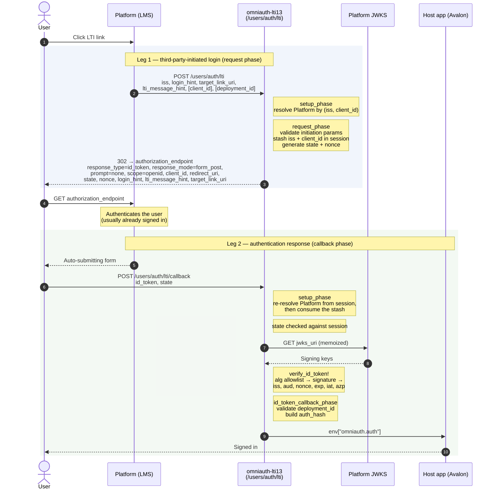
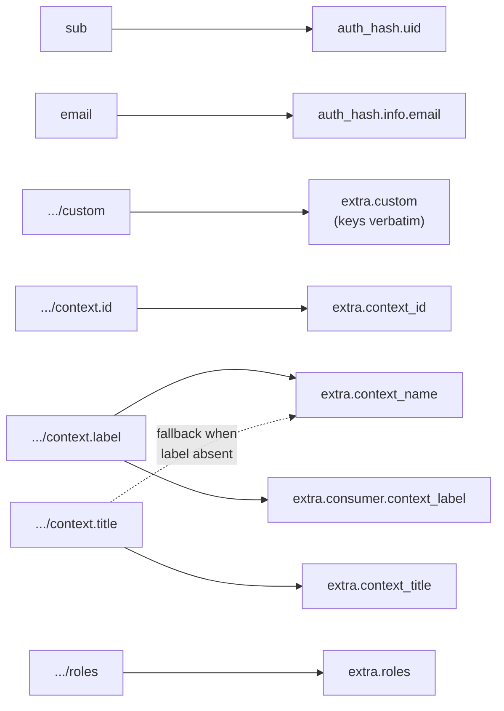

# LTI 1.3 authentication flow

How `omniauth-lti13` implements the LTI 1.3 Core launch, method by method. This is the
implementation reference; the [README](../README.md) covers configuration, the `auth_hash`
contract, and the rationale for each base-class override.

## Roles

| Role | Who | In this flow |
|---|---|---|
| **Platform** | The LMS (Canvas, Blackboard, Moodle) | Holds the user's identity, signs the `id_token`, publishes a JWKS |
| **Tool** | Avalon, via this gem | Receives the launch, verifies the token, produces an `auth_hash` |
| **Deployment** | One installation of the Tool in the Platform | Identified by `deployment_id`; a Platform may have several |

A launch is **two HTTP round-trips**, not one: a third-party-initiated login (the Platform asks
us to start OIDC) followed by an authentication response (the Platform posts back a signed
token). OmniAuth calls these the *request phase* and the *callback phase*, and the strategy's
methods are organized along the same split.

Everything that makes the second leg trustworthy — `state`, `nonce`, and the resolved platform
reference — is carried in the **session** between the two legs. That is why the session cookie
must survive a cross-site POST (`SameSite=None; Secure`); see the README.

## Sequence

On any validation failure the strategy raises, OmniAuth converts that to
`/auth/failure?message=…`, and the host app is never reached — the `App` participant simply
never receives `omniauth.auth`.

## Leg 1 — third-party-initiated login

The Platform POSTs (or GETs) the login-initiation request to `/users/auth/lti`.

**`setup_phase`** — runs before *both* legs, and resolves which registered Platform this request
belongs to:

1. `current_iss` / `current_client_id` read `iss` and `client_id` **from request params**, since
   this is the request leg.
2. `PlatformRegistry#find(issuer:, client_id:)` looks up the registration:
   - no match for the issuer → `nil`, raising `UnregisteredPlatformError`
   - exactly one match → that Platform, whether or not `client_id` was supplied
   - several matches (shared issuer) and no `client_id` → `AmbiguousPlatformError`
   - several matches and a `client_id` → the matching one, or `nil` (plus a log line naming
     `client_id`, since the resulting error blames the issuer)
3. `apply_platform!` writes the resolved values into `options.issuer` and `client_options`
   (`identifier`, `redirect_uri`, `authorization_endpoint`, `jwks_uri`), which is what the
   inherited OIDC machinery reads from.

**`request_phase`** — request-leg-only work, then delegation:

1. `validate_login_initiation!` → `validate_client_id!` rejects a `client_id` that is present
   but doesn't match the resolved Platform, then requires `login_hint` and `target_link_uri`.
   Rejecting here means a malformed launch fails on our side with a clear message, instead of
   becoming a broken authorization request that fails less legibly on the Platform's.
2. Stashes `omniauth.lti13.iss` and `omniauth.lti13.client_id` in the session for leg 2.
3. `super` builds the authorization redirect: `response_type=id_token`,
   `response_mode=form_post`, `prompt=none`, `scope=openid`, plus `state` and `nonce` (both
   stored in the session) and the three IMS round-trip params echoed back unchanged. Canvas
   rejects the request outright if `prompt=none` is missing, before any token is issued.

`client_id` and `deployment_id` from the initiation request are deliberately **not** forwarded
as authorize params — they are read for validation only, so an unauthenticated param can never
overwrite the `client_id` that platform lookup resolved.

## Leg 2 — authentication response

The Platform renders an auto-submitting form that POSTs `id_token` and `state` to the
`redirect_uri`.

**`setup_phase`** runs again, but resolves differently: `current_iss` / `current_client_id` now
read **from the session**, never from request params, then `consume_stashed_platform_ref!`
deletes them (one-time use, mirroring `state`/`nonce`). A callback with no prior request phase —
a missing or dropped session — therefore resolves no Platform and is rejected, rather than being
allowed to select one from an attacker-controlled `iss`.

The one exception: if the callback carries an `error` param, the Platform is telling us the
launch already failed on its side, so resolution is skipped and the inherited `callback_phase`
surfaces that error. Resolving first would raise `UnregisteredPlatformError` over the top of it
(the session key doesn't reliably survive an error redirect) and hide the real cause. Nothing is
authenticated on that path — it only decides which failure the operator sees.

**`state`** is then checked against the session by the inherited `callback_phase`.

**`verify_id_token!`** runs the claim checks, each a named method so the sequence reads as a
list:

| Order | Check | Failure |
|---|---|---|
| 1 | `validate_client_algorithm!` (via `decode_id_token`) — `RS256` only | `DisallowedAlgorithmError` |
| 2 | Signature, against the Platform JWKS | `KidNotFound` → one forced re-fetch, then raise |
| 3 | `validate_issuer!` — `iss` equals the resolved Platform's | `InvalidIdTokenError` |
| 4 | `validate_audience!` — `aud` includes our `client_id` | `InvalidIdTokenError` |
| 5 | `validate_nonce!` — equals the **session** nonce | `InvalidIdTokenError` |
| 6 | `validate_expiry!` — `exp` + `clock_skew` not past | `ExpiredTokenError` |
| 7 | `validate_issued_at!` — `iat` not beyond `clock_skew` in the future | `InvalidIdTokenError` |
| 8 | `validate_azp!` — if present, `azp` equals our `client_id` | `InvalidAzpError` |

**`id_token_callback_phase`** then validates `deployment_id` against the resolved Platform's
registered list — the last leg of *(issuer, client_id, deployment_id)* identifying a
deployment — and builds the `auth_hash`.

## Claim mapping

`context_name` prefers `label` and falls back to `title`, preserving LTI 1.1 semantics where
`Course.title` held the short label; `context_title` exposes the full title additively. When the
context claim carries neither, `context_name` is an explicit `nil` rather than an absent key, so
the host app can distinguish "not present" from "key missing".

Custom claim parameters — whatever was configured in the tool registration — land at
`extra.custom`, keyed exactly as the Platform named them. They sit on `extra` rather than `info`
because that is OmniAuth's split: `info` is a defined schema, `extra` is for provider-specific
data. `extra.custom` is always a Hash, empty when the claim is absent, so `extra.custom["x"]`
returns nil instead of raising on a nil intermediate — and nothing custom can shadow a standard
`info` field. This is deliberately the same shape the LTI 1.1 strategy exposes, so a host app
reading `extra.custom["…"]` works under either protocol.

The one dashed edge above is the sole precedence rule left: `title` fills `context_name` only
when `label` is absent. See the README for the full contract.

## Session keys

| Key | Written | Read | Cleared |
|---|---|---|---|
| `omniauth.state` | request phase | callback, by the base class | on read |
| `omniauth.nonce` | request phase | `validate_nonce!` | on read |
| `omniauth.lti13.iss` | `request_phase` | `current_iss` on callback | `consume_stashed_platform_ref!` |
| `omniauth.lti13.client_id` | `request_phase` | `current_client_id` on callback | `consume_stashed_platform_ref!` |

All four are one-time-use. All four are lost if the session cookie doesn't survive the
cross-site callback POST, which is the single most common integration failure — see the README's
"What the host app must handle".

## Where the host app plugs in

The strategy's only output is `env["omniauth.auth"]`. Avalon consumes it in
`User.find_for_lti`, keyed on `uid`, creating a `Course` from `extra.context_name` when present.
Nothing in this gem knows about Avalon; the `auth_hash` shape is the entire contract.
